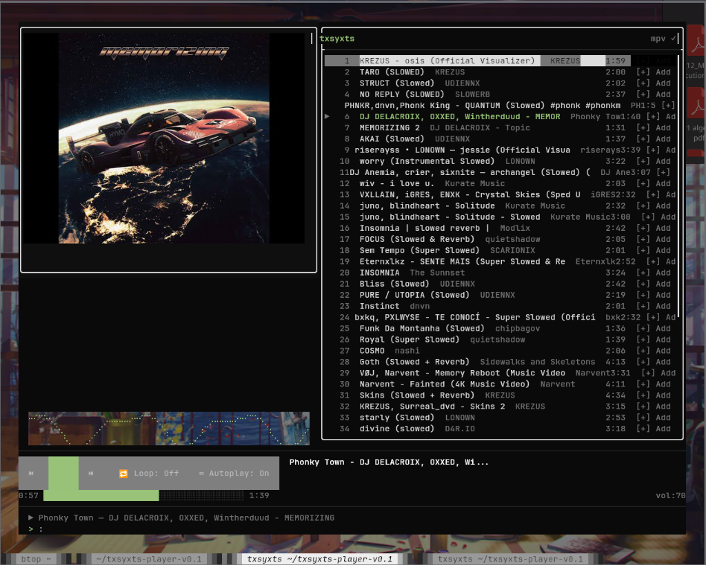
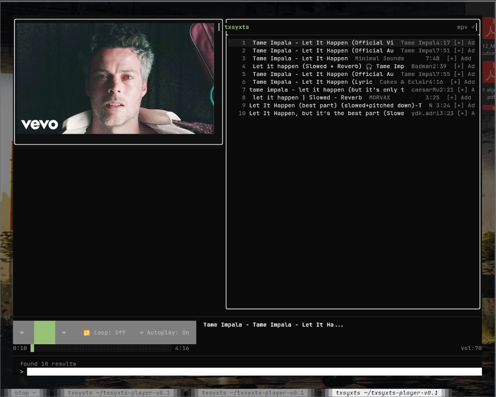

# txsyxts-player

minimal tui music player for linux. native c++ binary — just run `txsyxts`.



*High-resolution Kitty image protocol album art, seamless braille visualizer, and intelligent Youtube mix pre-loading.*

## what it does

- **youtube** — search and stream directly via yt-dlp + mpv
- **radio mix** — automatically queues similar songs to keep the music playing seamlessly (Spotify-style)
- **local** — play .mp3 / .flac / .ogg / .opus / .wav files from disk
- **local playlists** — instantly build and manage custom playlists on disk
- **visualizer** — high resolution sub-pixel braille wave visualizer
- **album art** — native Kitty terminal graphics protocol support for true image album art!
- **commands** — vim-style `:command` interface

no premium. no API keys. no python.



## install

```bash
git clone <repo>
cd txsyxts-player-v0.1
chmod +x install.sh
./install.sh
```

`install.sh` auto-detects your distro (Ubuntu/Debian, Arch, Fedora, openSUSE) and installs **all** required dependencies, then builds and installs the binary. Just run it and follow the prompt.

after install, just run: `txsyxts`

### manual dependency install (if needed)

<details>
<summary>build dependencies</summary>

```bash
# ubuntu/debian
sudo apt install build-essential cmake git pkg-config libmpv-dev libcurl4-openssl-dev

# arch linux
sudo pacman -S base-devel cmake git pkgconf mpv curl

# fedora
sudo dnf install @development-tools cmake git pkgconfig mpv-libs-devel libcurl-devel

# opensuse
sudo zypper install -t pattern devel_basis
sudo zypper install cmake git pkg-config mpv-devel libcurl-devel
```

</details>

<details>
<summary>runtime dependencies</summary>

```bash
# all distros — use pip for the latest yt-dlp
pip3 install yt-dlp

# ubuntu/debian
sudo apt install mpv

# arch linux
sudo pacman -S mpv

# fedora
sudo dnf install mpv

# opensuse
sudo zypper install mpv
```

</details>

<details>
<summary>optional — browser login helper (webkit2gtk)</summary>

```bash
# ubuntu/debian
sudo apt install libwebkit2gtk-4.1-dev libgtk-3-dev

# arch linux
sudo pacman -S webkit2gtk-4.1 gtk3

# fedora
sudo dnf install webkit2gtk4.1-devel gtk3-devel
```

When present, `install.sh` will build `txsyxts-login` automatically.

</details>

## commands

| command | description |
|---|---|
| `:play <url>` | stream a youtube video or entire playlist directly |
| `:search <query>` | search youtube for songs |
| `:local <path>` | load local audio files |
| `:pl-create <name>` | create a new local playlist |
| `:playlists` | list local playlists |
| `:pause` / `:p` | toggle pause |
| `:next` / `:n` | next track |
| `:prev` | previous track |
| `:stop` / `:s` | stop playback |
| `:seek <±sec>` | seek forward/back |
| `:vol <0-100>` | set volume |
| `:queue` / `:q` | show queue |
| `:shuffle` / `:sh` | toggle shuffle |
| `:loop` / `:lo` | cycle loop mode |
| `:clear` | clear track list |
| `:config` | show/edit config |
| `:help` / `:h` | show help |
| `:quit` / `:exit` | exit |

> **Note:** Spotify integration is currently disabled and is marked as "coming soon" while we migrate to a new authentication flow!

## keybindings

| key | action |
|---|---|
| `j` / `k` | navigate track list |
| `Enter` | play selected track |
| `d` / `Delete` | instantly remove song from currently viewed playlist |
| `b` | go back to playlists menu |
| `Space` | toggle pause |
| `Ctrl+N` | next track |
| `Ctrl+P` | previous track |
| `Ctrl+Q` | quit |

## how it works

```
youtube search (yt-dlp)
       ↓
audio stream → mpv → speakers
```

- actual audio is streamed from **youtube** via yt-dlp
- playback through **mpv** (lightweight, linux-native)
- built with **FTXUI** (modern C++ terminal UI)

## tech stack

| component | library |
|---|---|
| TUI | FTXUI |
| Audio | libmpv |
| HTTP | libcurl |
| JSON | nlohmann/json |
| YouTube | yt-dlp |
| Build | CMake |

## license

mit
